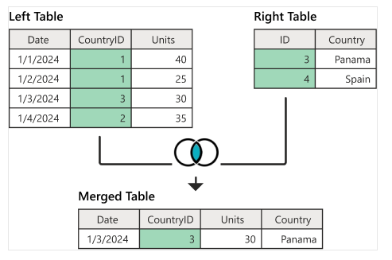
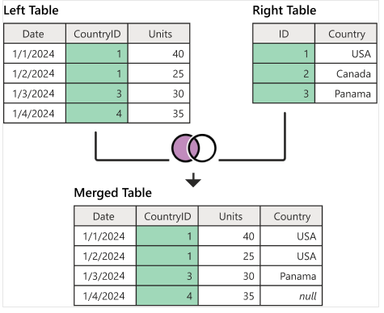
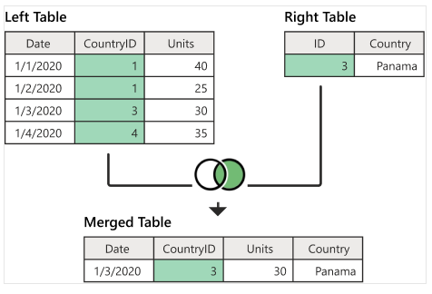
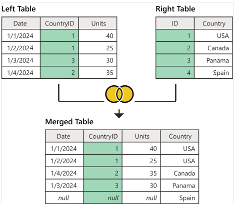
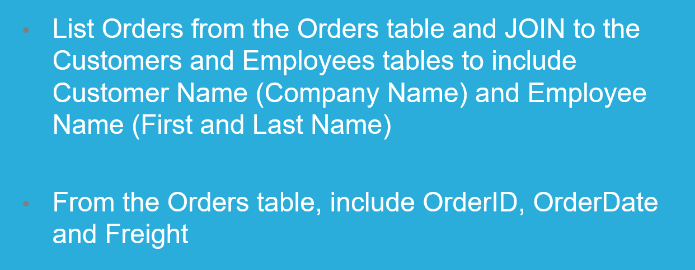

# TYPES OF JOINS

## A JOIN is an SQL keywork used to combine matched rows to two or more tables

## JOIN / INNER JOIN
- Returns any rows where there is a matched key in BOTH tables
- Join through a relationship column in the tables
#### SELECT * FROM LeftTable INNER JOIN RighTable ON LeftTable.CountryID = RightTable.ID

---

## LEFT JOIN
- Returns all records from the left table (table1), and the matching records from the right table (table2).
- Priorty Left
- The result is 0 records from the right side, if there is no match
#### SELECT * FROM LeftTable LEFT JOIN RightTable ON LeftTable.CountryID = RightTable.ID

---

## RIGHT JOIN
- Same as Left but switched tables
-  Priority Right
- The result is 0 records from the left side, if there is no match
#### SELECT * FROM LeftTable LEFT JOIN RightTable ON LeftTable.CountryID = RightTable.ID

---

## FULL JOIN
- Returns all records when there is a match in left or right table records

---

## Task 1

