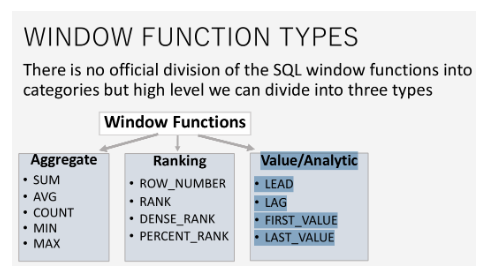
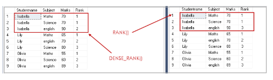

# Advanced SQL

## Analytic Functions (Window functions)
### Perform calculations across a set of tables and rows that are related to the current row
- Last in the operation line
- Not Affected by the GROUP BY function

## Analytic vs Aggregate Functions (SUM, AVG)
### The Main difference is that aggregate functions reduce the number and rows from tables where analytic functions return the whole columns and rows

## PARTITION BY (Similar to GROUP BY)
### COUNT(p.ProductID) OVER (PARTITION BY c.CategoryID) AS ProductsInCategory
### Used to divide the result set into partitions and perform computation on each subset of partitioned data.
- Not placing anything in over will just count everything in the table
- OVER (PARTITION BY c.CategoryID) will count the category ID

## ORDER BY / ROW_NUMBER
### SELECT * ROW_NUMBER() OVER (PARTITION BY ___ ORDER BY ___ DESC)
### RANK helps deal with duplicates
- ROWNUMBER and RANK are similar

## LEAD / LAG
### LEAD(___, 1, NULL) OVER (ORDER BY ___)
### LEAD looks ahead a certian number of rows
- Takes 3 arguments
- Column to return
- number of rows to look forward
- default value if nothing can be returned

## FIRST_VALUE
### Returns the first row based on ORDER BY, for each partition
- It takes one argument - column name to return from the first row

## WITH
- Prevent repeated execution of subqueries
- Create temporary tables to be used in the rest of the query
- WITH clauses define the subqueries before the main query
- WITH MeanAbove30 AS (SELECT ___) FROM ___

## Temporary Tables
- If you want a temporary table to exist after the query
- Tempory Tables always begin with #

## Pivot Tables
- Essentially re-formatting the table (Rows and Columns)