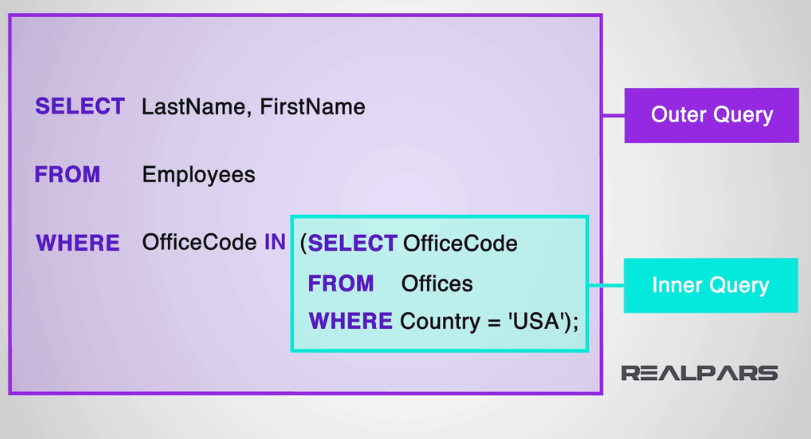
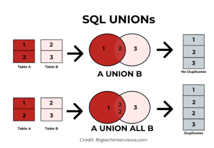
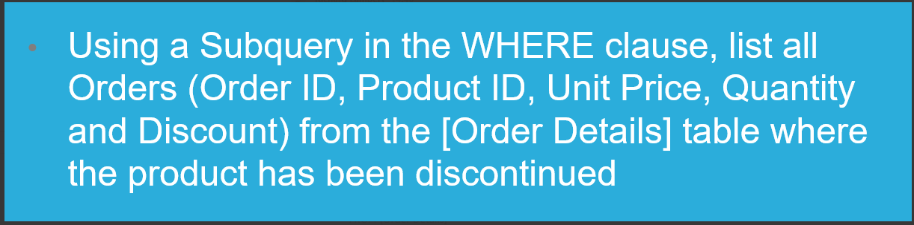

# SUBQUERIES

## A subquery is a nested query
- Query inside a query
- SELECT subqueries must be in brackets (SELECT etc)

---

## UNION ALL VS UNION
- UNION combines the result sets of two or more SELECT queries into a single result set
- UNION ALL selects all values. In other words, UNION ALL will not remove duplicate rows.

---

## Task 2

